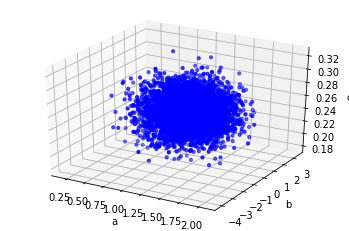
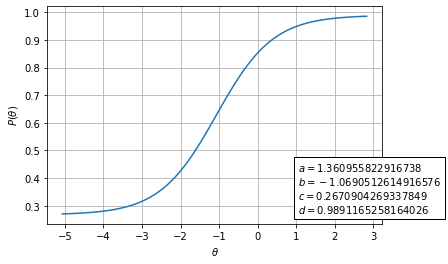
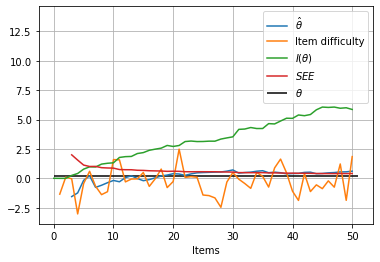

Example usages
==============

|image0|

This is a tutorial for
`catsim <https://github.com/douglasrizzo/catsim/>`__, a Python package
which allows users to simulate computerized adaptive tests or to use in
their own applications with the purpose of automating adaptive tests.

This tutorial was originally developed as a notebook on Google Colab,
so, if for any reason you are seeing this outside of Colab, you can go
back to Colab, copy it and test it yourself using `this
link <https://colab.research.google.com/drive/14zEWoDudBCXF0NO-qgzoQpWUGBcJ2lPH?usp=sharing>`__.

In this notebook, I’ll exemplify both approaches. The documentation of
all modules and functions used here are available in the `catsim
website <https://douglasrizzo.com.br/catsim/index.html>`__.

First, let’s install catsim and import the relevant modules:

.. |image0| image:: https://douglasrizzo.com.br/catsim/_static/logo_text.svg

.. code:: 

    !pip install -U catsim

.. parsed-literal::

    Collecting catsim
      Downloading https://files.pythonhosted.org/packages/af/46/a803430c2b1711c1793a7aad0ff878a36b0262f34c06a2bbef4156fd78f7/catsim-0.15.6.tar.gz
    Requirement already satisfied, skipping upgrade: scipy in /usr/local/lib/python3.6/dist-packages (from catsim) (1.4.1)
    Requirement already satisfied, skipping upgrade: numexpr in /usr/local/lib/python3.6/dist-packages (from catsim) (2.7.1)
    Requirement already satisfied, skipping upgrade: matplotlib in /usr/local/lib/python3.6/dist-packages (from catsim) (3.2.2)
    Requirement already satisfied, skipping upgrade: scikit-learn in /usr/local/lib/python3.6/dist-packages (from catsim) (0.22.2.post1)
    Collecting json_tricks
      Downloading https://files.pythonhosted.org/packages/5f/09/603c6d30babd527df4851696ebeddce4b6a0bc6468f143b39094c97cd830/json_tricks-3.15.2-py2.py3-none-any.whl
    Requirement already satisfied, skipping upgrade: tqdm in /usr/local/lib/python3.6/dist-packages (from catsim) (4.41.1)
    Requirement already satisfied, skipping upgrade: numpy in /usr/local/lib/python3.6/dist-packages (from catsim) (1.18.5)
    Requirement already satisfied, skipping upgrade: cycler>=0.10 in /usr/local/lib/python3.6/dist-packages (from matplotlib->catsim) (0.10.0)
    Requirement already satisfied, skipping upgrade: pyparsing!=2.0.4,!=2.1.2,!=2.1.6,>=2.0.1 in /usr/local/lib/python3.6/dist-packages (from matplotlib->catsim) (2.4.7)
    Requirement already satisfied, skipping upgrade: python-dateutil>=2.1 in /usr/local/lib/python3.6/dist-packages (from matplotlib->catsim) (2.8.1)
    Requirement already satisfied, skipping upgrade: kiwisolver>=1.0.1 in /usr/local/lib/python3.6/dist-packages (from matplotlib->catsim) (1.2.0)
    Requirement already satisfied, skipping upgrade: joblib>=0.11 in /usr/local/lib/python3.6/dist-packages (from scikit-learn->catsim) (0.15.1)
    Requirement already satisfied, skipping upgrade: six in /usr/local/lib/python3.6/dist-packages (from cycler>=0.10->matplotlib->catsim) (1.12.0)
    Building wheels for collected packages: catsim
      Building wheel for catsim (setup.py) ... [?25l[?25hdone
      Created wheel for catsim: filename=catsim-0.15.6-cp36-none-any.whl size=32830 sha256=08a8dc366e6722d039f738a2fc64a3faf8fe196729046e1da65380d21b52585a
      Stored in directory: /root/.cache/pip/wheels/a5/0f/5c/b18a1825e3918b7deaa0b90f1432053e7b41ea21537859e999
    Successfully built catsim
    Installing collected packages: json-tricks, catsim
    Successfully installed catsim-0.15.6 json-tricks-3.15.2

.. code:: 

    # this function generates an item bank, in case the user cannot provide one
    from catsim.cat import generate_item_bank
    # simulation package contains the Simulator and all abstract classes
    from catsim.simulation import *
    # initialization package contains different initial proficiency estimation strategies
    from catsim.initialization import *
    # selection package contains different item selection strategies
    from catsim.selection import *
    # estimation package contains different proficiency estimation methods
    from catsim.estimation import *
    # stopping package contains different stopping criteria for the CAT
    from catsim.stopping import *
    import catsim.plot as catplot
    from catsim.irt import icc
    
    import matplotlib.pyplot as plt

Generating an item bank
-----------------------

The ``generate_item_bank()`` function provides a convenient way to
generate realistic item parameter matrices from probability
distributions.

.. code:: 

    bank_size = 5000
    items = generate_item_bank(bank_size)
    catplot.gen3d_dataset_scatter(items)

Visualizing parameter distribution
~~~~~~~~~~~~~~~~~~~~~~~~~~~~~~~~~~

``generate_item_bank()`` returns a numpy.ndarray with 4 columns,
corresponding to the discrimination, difficulty, guessing and
upper-asymptote parameters of the 4-parameter logistic model of Item
Response Theory.

We can plot and visualize their distributions like so:

.. code:: 

    catplot.param_dist(items, figsize=(9,7))

.. image:: examples_files/examples_6_0.png

Visualizing individual items
~~~~~~~~~~~~~~~~~~~~~~~~~~~~

catsim also provides a function to plot the characteristic curve of an
item. Notice how this item has been generated according to the
4-parameter logistic model of the Item Response Theory. Item banks under
different logistic models can be generated by changing the ``itemtype``
parameter of ``generate_item_bank()``.

.. code:: 

    a, b, c, d = items[0]
    catplot.item_curve(a,b,c,d)

Running simulations
-------------------

A simulation requires the following objects:

-  an item parameter matrix
-  a proficiency initializer, which sets the initial :math:`\theta`
   values for examinees
-  an item selector, which selects items to be applied to examinees
   according to some rule
-  a proficiency estimator, which estimates the new :math:`\theta`
   values for examinees after an item is answered
-  a “stopper”, an object which checks if the test must be stopped
   according to some rule

We have already created an item parameter matrix, so let’s go ahead and
create the other objects…

.. code:: 

    initializer = RandomInitializer()
    selector = MaxInfoSelector()
    estimator = HillClimbingEstimator()
    stopper = MaxItemStopper(20)

catsim provides different options for each of the aforementioned types
of objects in the following modules

-  ``catsim.simulation``
-  ``catsim.initialization``
-  ``catsim.selection``
-  ``catsim.estimation``

Each module also provides an abstract base class which can be inherited
in order to create new methods that can be used in the simulation
process.

Creating a simulator
~~~~~~~~~~~~~~~~~~~~

The Simulator is the object that takes all of the objects created
previously and executes a CAT simulation. To represent the examinees,
The Simulator can receive either an integer, which will be converted to
a normal distribution, or a 1D ``numpy.ndarray``, whose values will be
used as the proficiencies of the examinees.

Here we will use an integer.

.. code:: 

    s = Simulator(items, 10, RandomInitializer(), MaxInfoSelector(), HillClimbingEstimator(), MaxItemStopper(50))

Starting the simulation
~~~~~~~~~~~~~~~~~~~~~~~

To execute the simulations, call the simulate() method of the Simulator
object.

.. code:: 

    s.simulate(verbose=True)

.. parsed-literal::

    Starting simulation: Random Initializer Maximum Information Selector Hill Climbing Estimator Maximum Item Number Initializer 5000 items
    100%|██████████| 10/10 [00:05<00:00,  1.72it/s]

    Simulation took 5.8171546459198 seconds

Acessing simulation results
~~~~~~~~~~~~~~~~~~~~~~~~~~~

After the simulation if over, information is provided through the
attributes of the Simulator:

.. code:: 

    print('Bias:', s.bias)
    print('Mean squared error:', s.mse)
    print('Root mean squared error:', s.rmse)

.. parsed-literal::

    Bias: -0.12877908953331357
    Mean squared error: 0.10927905639507059
    Root mean squared error: 0.33057382896271537

Information for individual examinees can also be accessed through the
attributes of the Simulator.

.. code:: 

    examinee_index = 0
    print('Accessing examinee', examinee_index, 'results...')
    print('    True proficiency:', s.examinees[examinee_index])
    print('    Items administered:', s.administered_items[examinee_index])
    print('    Responses:', s.response_vectors[examinee_index])
    print('    Proficiency estimation during each step of the test:', s.estimations[examinee_index])

.. parsed-literal::

    Accessing examinee 0 results...
        True proficiency: -0.2816785228767416
        Items administered: [1794, 0, 3336, 2475, 1879, 1768, 4025, 1222, 900, 2399, 3556, 2287, 2485, 1273, 2391, 3442, 70, 1724, 3589, 1585, 2230, 3714, 2044, 543, 996, 2692, 2566, 3316, 1243, 516, 90, 4784, 2893, 4075, 2514, 3916, 3281, 4946, 3961, 2174, 441, 3505, 142, 4108, 4039, 3970, 3866, 4659, 1801, 3128]
        Responses: [True, True, False, True, False, True, False, True, True, False, False, True, True, True, False, False, True, False, False, True, True, True, True, True, True, True, False, True, True, True, True, True, False, False, False, False, True, True, True, True, False, True, False, False, True, False, True, True, True, True]
        Proficiency estimation during each step of the test: [-2.9062367750482476, inf, inf, -0.8645929540106936, -0.4000937535082434, -1.0984746111118635, -0.8523400481400345, -1.2698782015572956, -1.0729249779445948, -0.8448001617230141, -1.065419646674027, -1.3754326555875702, -1.2138690054229484, -1.0891772226836556, -0.9819440114965495, -1.154819511564105, -1.339700019932513, -1.2320382801141416, -1.4062619544561699, -1.5579952313912742, -1.4617917667004856, -1.384430722645969, -1.2949916487176605, -1.2409486213125227, -1.1706229487693933, -1.0933573080599417, -1.0404774627310964, -1.105931582126757, -1.0610697847401798, -1.014087695805288, -0.9576764350218117, -0.9143005089326925, -0.8608950194549864, -0.9180361878629862, -0.9784988359602548, -1.039387055887484, -1.0826369520017567, -1.0414606979162682, -1.0025638352769068, -0.9729843792641382, -0.9241130070522614, -0.9815002657882789, -0.9374991266848149, -1.020429275472375, -1.0972120361274151, -1.0633721669862448, -1.083039048251386, -1.043512265559606, -1.0135620128739955, -0.9841406046060365, -0.9537218651754478]

The test progress for an individual examinee can also be plotted using
the ``catsim.plot.test_progress(function)``. The amount of information
in the chart can be tuned using different arguments for the function.

.. code:: 

    catplot.test_progress(simulator=s,index=0)

.. image:: examples_files/examples_21_0.png

Simulation example 2
~~~~~~~~~~~~~~~~~~~~

This example uses a ``numpy.ndarray`` to represent examinees. We will
also plot more information than before in our test progress plot, adding
test information to it.

.. code:: 

    examinees = numpy.random.normal(size=10)
    s = Simulator(items, examinees, RandomInitializer(), MaxInfoSelector(), HillClimbingEstimator(), MinErrorStopper(.3))
    s.simulate(verbose=True)
    catplot.test_progress(simulator=s,index=0, info=True)

.. parsed-literal::

    Starting simulation: Random Initializer Maximum Information Selector Hill Climbing Estimator Minimum Error Initializer 5000 items
    
    python3.6/dist-packages/catsim/irt.py:142: RuntimeWarning: divide by zero encountered in double_scalars
      return 1 / test_info(theta, items)
    100%|██████████| 10/10 [00:07<00:00,  1.33it/s]

.. parsed-literal::

    Simulation took 7.508302450180054 seconds

.. image:: examples_files/examples_23_3.png

Simulating non-adaptive tests
~~~~~~~~~~~~~~~~~~~~~~~~~~~~~

catsim can also simulate linear (non-adaptive) tests by using a linear
item selector. The linear selector receives the item indices as
arguments, retrieves them from the item parameter matrix and applies
them in order to all examinees.

.. code:: 

    indexes = numpy.random.choice(items.shape[0], 50, replace=False)
    print('The following items will be applied to the examinees in this order:', indexes)
    s = Simulator(items, 10, RandomInitializer(), LinearSelector(indexes), HillClimbingEstimator(), MaxItemStopper(50))
    s.simulate(verbose=True)

.. parsed-literal::

    The following items will be applied to the examinees in this order: [4869 2944 2371 2000  721  920 4166 1933 3127 1938 4922 2814 4624 1828
      521 3600 1830 2676 3323 4494 1114 4700  549 2997 1463 1955 2639 2975
     3313 4093 4930 4368  292 2531 3767  228 1202  554 4671  310 1294 2387
      142 3150 2717 4207  885 4440  600 1128]
    
    Starting simulation: Random Initializer Linear Selector Hill Climbing Estimator Maximum Item Number Initializer 5000 items

    100%|██████████| 10/10 [00:02<00:00,  4.76it/s]

    Simulation took 2.101578950881958 seconds

Here, we will also plot the estimation error for an examinee’s
:math:`\hat\theta` value during the progress of the test.

.. code:: 

    catplot.test_progress(simulator=s,index=0, info=True, see=True)

.. parsed-literal::

    /usr/local/lib/python3.6/dist-packages/catsim/irt.py:142: RuntimeWarning: divide by zero encountered in double_scalars
      return 1 / test_info(theta, items)

Using catsim objects outside of a Simulator
-------------------------------------------

The objects provided by catsim can also be used directly, outside of a
simulation. This allows users to use these objects in their own
software, to power their own CAT applications.

Let’s pretend we are in the middle of a test application and create some
dummy data for an examinee, as well as some objects we will use to
select the next item for this examinee, re-estimate their proficiency
and check if the test should be stopped or if a new item should be
applied to the examinee.

.. code:: 

    responses = [True, True, False, False]
    administered_items = [1435, 3221, 17, 881]
    
    initializer = RandomInitializer()
    selector = MaxInfoSelector()
    estimator = HillClimbingEstimator()
    stopper = MaxItemStopper(20)

This dummy data means that the examinee has answered items 1435, 3221,
17 and 881 from our item bank (generated at the start of this notebook).
They have answered the first two items correctly (represented by the
``True`` values in the ``responses`` list) and two items incorrectly
(the last values in the list).

Initializing :math:`\hat\theta`
~~~~~~~~~~~~~~~~~~~~~~~~~~~~~~~

Even though this information is already enough to estimate the current
proficiency of the examinee, we’ll go ahead and use our initializer to
estimate a dummy initial proficiency anyway.

.. code:: 

    est_theta = initializer.initialize()
    print('Examinee initial proficiency:', est_theta)

.. parsed-literal::

    Examinee initial proficiency: 2.5662180237120156

Estimating a new :math:`\hat\theta`
~~~~~~~~~~~~~~~~~~~~~~~~~~~~~~~~~~~

Now, we will use the answers the examinee has given so far (remember,
we’re pretending they have already answered a few items) to estimate a
more precise :math:`\hat\theta` proficiency for them.

Internally, the estimator uses the item bank and the indices of the
administered items to get the relevant item parameters, then uses the
response vector to know which items the examinee has answered correctly
and incorrectly to generate the new value for :math:`\hat\theta`.

Some estimators may or may not use the current value of
:math:`\hat\theta` to speed up estimation.

**After getting to the end of the notebook, come back to this cell to
simulate a new item being applied to this examinee**.

.. code:: 

    new_theta = estimator.estimate(items=items, administered_items=administered_items, response_vector=responses, est_theta=est_theta)
    print('Estimated proficiency, given answered items:', new_theta)

.. parsed-literal::

    Estimated proficiency, given answered items: -1.695833205771666

Checking whether the test should end
~~~~~~~~~~~~~~~~~~~~~~~~~~~~~~~~~~~~

We do not know whether the CAT should select another item to the
examinee or if the test should end. The stoper will give us this answer
through the ``stop()`` method.

.. code:: 

    _stop = stopper.stop(administered_items=items[administered_items], theta=est_theta)
    print('Should the test be stopped:', _stop)

.. parsed-literal::

    Should the test be stopped: False

Selecting a new item
~~~~~~~~~~~~~~~~~~~~

The selector takes the item parameter matrix and the current
:math:`\hat\theta` value to select the new item the examinee will
answer. It uses the indices of administered items to ignore them.

.. code:: 

    item_index = selector.select(items=items, administered_items=administered_items, est_theta=est_theta)
    print('Next item to be administered:', item_index)

.. parsed-literal::

    Next item to be administered: 2245

    /usr/local/lib/python3.6/dist-packages/catsim/selection.py:87: UserWarning: This selector needs an item matrix with at least 5 columns, with the last one representing item exposure rate. Since this column is absent, it will presume all items have exposure rates = 0
      'This selector needs an item matrix with at least 5 columns, with the last one representing item exposure rate. Since this column is absent, it will presume all items have exposure rates = 0'

Simulating a response
~~~~~~~~~~~~~~~~~~~~~

In order to apply the next item, we need to pretend here that the
examinee has answered an item. In the real world, this information could
be fetched by an external application, but here we will use IRT to
simulate the answer probabilistically.

(By the way, this is exactly what the Simulator does during
simulations.)

.. code:: 

    a, b, c, d = items[item_index]
    prob = icc(est_theta, a, b, c, d)
    correct = numpy.random.uniform() > prob
    
    print('Probability to correctly answer item:', prob)
    print('Did the user answer the selected item correctly?', correct)

.. parsed-literal::

    Probability to correctly answer item: 0.6605443041512475
    Did the user answer the selected item correctly? True

Finally, we add the index of the administered item to the examinee and
their answer to the item to our lists and we are ready for the next step
of the adaptive test.

Go back to the **“Estimating a new :math:`\hat\theta`”** step above to
simulate another step of the CAT.

.. code:: 

    administered_items.append(item_index)
    responses.append(correct)
