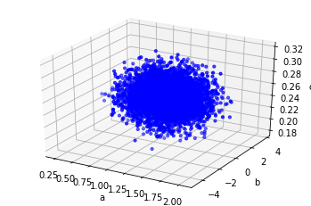
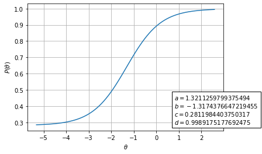
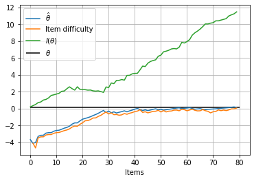
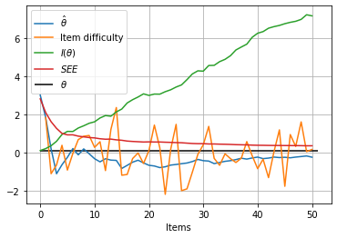

Introduction to catsim by example
=================================

|image0|

This is a tutorial for
`catsim <https://github.com/douglasrizzo/catsim/>`__, a Python package
which allows users to simulate computerized adaptive tests or to use in
their own applications with the purpose of automating adaptive tests.

This tutorial was originally developed as a notebook on Google Colab,
so, if for any reason you are seeing this outside of Colab, you can go
back to Colab, copy it and test it yourself using `this
link <https://colab.research.google.com/drive/14zEWoDudBCXF0NO-qgzoQpWUGBcJ2lPH?usp=sharing>`__.

In this notebook, I’ll exemplify both approaches. The documentation of
all modules and functions used here are available in the `catsim
website <https://douglasrizzo.com.br/catsim/index.html>`__.

First, let’s install catsim and import the relevant modules:

.. |image0| image:: https://douglasrizzo.com.br/catsim/_static/logo_text.svg

.. code:: ipython3

    !pip install catsim

.. parsed-literal::

    Requirement already satisfied: catsim in /usr/local/lib/python3.6/dist-packages (0.15.4)
    Requirement already satisfied: tqdm in /usr/local/lib/python3.6/dist-packages (from catsim) (4.41.1)
    Requirement already satisfied: numpy in /usr/local/lib/python3.6/dist-packages (from catsim) (1.18.5)
    Requirement already satisfied: json-tricks in /usr/local/lib/python3.6/dist-packages (from catsim) (3.15.2)
    Requirement already satisfied: numexpr in /usr/local/lib/python3.6/dist-packages (from catsim) (2.7.1)
    Requirement already satisfied: scikit-learn in /usr/local/lib/python3.6/dist-packages (from catsim) (0.22.2.post1)
    Requirement already satisfied: matplotlib in /usr/local/lib/python3.6/dist-packages (from catsim) (3.2.2)
    Requirement already satisfied: scipy in /usr/local/lib/python3.6/dist-packages (from catsim) (1.4.1)
    Requirement already satisfied: joblib>=0.11 in /usr/local/lib/python3.6/dist-packages (from scikit-learn->catsim) (0.15.1)
    Requirement already satisfied: kiwisolver>=1.0.1 in /usr/local/lib/python3.6/dist-packages (from matplotlib->catsim) (1.2.0)
    Requirement already satisfied: cycler>=0.10 in /usr/local/lib/python3.6/dist-packages (from matplotlib->catsim) (0.10.0)
    Requirement already satisfied: pyparsing!=2.0.4,!=2.1.2,!=2.1.6,>=2.0.1 in /usr/local/lib/python3.6/dist-packages (from matplotlib->catsim) (2.4.7)
    Requirement already satisfied: python-dateutil>=2.1 in /usr/local/lib/python3.6/dist-packages (from matplotlib->catsim) (2.8.1)
    Requirement already satisfied: six in /usr/local/lib/python3.6/dist-packages (from cycler>=0.10->matplotlib->catsim) (1.12.0)

.. code:: ipython3

    # this function generates an item bank, in case the user cannot provide one
    from catsim.cat import generate_item_bank
    # simulation package contains the Simulator and all abstract classes
    from catsim.simulation import *
    # initialization package contains different initial proficiency estimation strategies
    from catsim.initialization import *
    # selection package contains different item selection strategies
    from catsim.selection import *
    # estimation package contains different proficiency estimation methods
    from catsim.estimation import *
    # stopping package contains different stopping criteria for the CAT
    from catsim.stopping import *
    import catsim.plot as catplot
    from catsim.irt import icc
    
    import matplotlib.pyplot as plt

Generating an item bank
-----------------------

The ``generate_item_bank()`` function provides a convenient way to
generate realistic item parameter matrices from probability
distributions.

.. code:: ipython3

    bank_size = 5000
    items = generate_item_bank(bank_size)
    catplot.gen3d_dataset_scatter(items)

.. parsed-literal::

    

Visualizing parameter distribution
~~~~~~~~~~~~~~~~~~~~~~~~~~~~~~~~~~

``generate_item_bank()`` returns a numpy.ndarray with 4 columns,
corresponding to the discrimination, difficulty, guessing and
upper-asymptote parameters of the 4-parameter logistic model of Item
Response Theory.

We can plot and visualize their distributions like so:

.. code:: ipython3

    fig, axes = plt.subplots(2, 2, figsize=(9,7))
    _ = axes[0,0].hist(items[:,0], bins=100)
    _ = axes[0,1].hist(items[:,1], bins=100)
    _ = axes[1,0].hist(items[:,2], bins=100)
    _ = axes[1,1].hist(items[:,3], bins=100)

Visualizing individual items
~~~~~~~~~~~~~~~~~~~~~~~~~~~~

catsim also provides a function to plot the characteristic curve of an
item. Notice how this item has been generated according to the
4-parameter logistic model of the Item Response Theory. Item banks under
different logistic models can be generated by changing the ``itemtype``
parameter of ``generate_item_bank()``.

.. code:: ipython3

    a, b, c, d = items[0]
    catplot.item_curve(a,b,c,d)

.. image:: output_8_0.png

Running simulations
-------------------

A simulation requires the following objects:

-  an item parameter matrix
-  a proficiency initializer, which sets the initial :math:`\theta`
   values for examinees
-  an item selector, which selects items to be applied to examinees
   according to some rule
-  a proficiency estimator, which estimates the new :math:`\theta`
   values for examinees after an item is answered
-  a “stopper”, an object which checks if the test must be stopped
   according to some rule

We have already created an item parameter matrix, so let’s go ahead and
create the other objects…

.. code:: ipython3

    initializer = RandomInitializer()
    selector = MaxInfoSelector()
    estimator = HillClimbingEstimator()
    stopper = MaxItemStopper(20)

catsim provides different options for each of the aforementioned types
of objects in the following modules

-  ``catsim.simulation``
-  ``catsim.initialization``
-  ``catsim.selection``
-  ``catsim.estimation``

Each module also provides an abstract base class which can be inherited
in order to create new methods that can be used in the simulation
process.

Creating a simulator
~~~~~~~~~~~~~~~~~~~~

The Simulator is the object that takes all of the objects created
previously and executes a CAT simulation. To represent the examinees,
The Simulator can receive either an integer, which will be converted to
a normal distribution, or a 1D ``numpy.ndarray``, whose values will be
used as the proficiencies of the examinees.

Here we will use an integer.

.. code:: ipython3

    s = Simulator(items, 10, RandomInitializer(), MaxInfoSelector(), HillClimbingEstimator(), MaxItemStopper(50))

.. parsed-literal::

    

Starting the simulation
~~~~~~~~~~~~~~~~~~~~~~~

To execute the simulations, call the simulate() method of the Simulator
object.

.. code:: ipython3

    s.simulate(verbose=True)

.. parsed-literal::

      0%|          | 0/10 [00:00<?, ?it/s]

.. parsed-literal::

    Starting simulation: Random Initializer Maximum Information Selector Hill Climbing Estimator Maximum Item Number Initializer 5000 items

.. parsed-literal::

    100%|██████████| 10/10 [00:06<00:00,  1.61it/s]

.. parsed-literal::

    Simulation took 6.206281900405884 seconds

.. parsed-literal::

    

Acessing simulation results
~~~~~~~~~~~~~~~~~~~~~~~~~~~

After the simulation if over, information is provided through the
attributes of the Simulator:

.. code:: ipython3

    print('Bias:', s.bias)
    print('Mean squared error:', s.mse)
    print('Root mean squared error:', s.rmse)

.. parsed-literal::

    Bias: -0.35394128227922633
    Mean squared error: 0.9688648393623304
    Root mean squared error: 0.9843093209770648

Information for individual examinees can also be accessed through the
attributes of the Simulator.

.. code:: ipython3

    examinee_index = 0
    print('Accessing examinee', examinee_index, 'results...')
    print('    True proficiency:', s.examinees[examinee_index])
    print('    Items administered:', s.administered_items[examinee_index])
    print('    Responses:', s.response_vectors[examinee_index])
    print('    Proficiency estimation during each step of the test:', s.estimations[examinee_index])

.. parsed-literal::

    Accessing examinee 0 results...
        True proficiency: 0.5490604939976603
        Items administered: [4118, 1917, 1128, 4248, 767, 3572, 4109, 3500, 2745, 4863, 3602, 498, 4339, 4421, 637, 2096, 2396, 3825, 2518, 4507, 3854, 3987, 2639, 3062, 322, 2248, 2659, 2702, 3104, 1563, 4220, 106, 480, 2405, 645, 1293, 4741, 2167, 4030, 715, 1338, 3210, 3128, 4363, 2786, 4467, 3455, 2496, 4681, 4119]
        Responses: [False, True, True, True, True, True, True, True, True, True, True, True, True, True, True, True, True, True, True, True, True, True, True, True, False, True, True, True, True, True, True, True, False, True, True, True, True, True, True, False, True, True, True, True, True, True, True, True, False, True]
        Proficiency estimation during each step of the test: [-1.9760342267420352, -2.1431976245351447, -2.312866831555607, -2.088142647139371, -2.088142647139371, -2.088142647139371, -2.088142647139371, -2.088142647139371, -2.088142647139371, -2.088142647139371, -2.088142647139371, -2.088142647139371, -2.088142647139371, -2.088142647139371, -2.088142647139371, -2.088142647139371, -2.088142647139371, -2.088142647139371, -2.088142647139371, -2.088142647139371, -2.088142647139371, -2.088142647139371, -2.088142647139371, -2.088142647139371, -2.088142647139371, -2.088142647139371, -2.088142647139371, -2.088142647139371, -2.088142647139371, -2.088142647139371, -2.088142647139371, -2.088142647139371, -2.086901001555195, -2.086901001555195, -2.083050730387461, -2.083050730387461, -2.083050730387461, -2.083050730387461, -2.083050730387461, -2.083050730387461, -2.083050730387461, -2.083050730387461, -2.0229576943290755, -2.0229576943290755, -2.0229576943290755, -2.0229576943290755, -2.0229576943290755, -1.9922614950981845, -1.9922614950981845, -1.9922614950981845, -1.9922614950981845]

The test progress for an individual examinee can also be plotted using
the ``catsim.plot.test_progress(function)``. The amount of information
in the chart can be tuned using different arguments for the function.

.. code:: ipython3

    catplot.test_progress(simulator=s,index=0)

.. image:: output_21_0.png

Simulation example 2
~~~~~~~~~~~~~~~~~~~~

This example uses a ``numpy.ndarray`` to represent examinees. We will
also plot more information than before in our test progress plot, adding
test information to it.

.. code:: ipython3

    examinees = numpy.random.normal(size=10)
    s = Simulator(items, examinees, RandomInitializer(), MaxInfoSelector(), HillClimbingEstimator(), MinErrorStopper(.3))
    s.simulate(verbose=True)
    catplot.test_progress(simulator=s,index=0, info=True)

.. parsed-literal::

      0%|          | 0/10 [00:00<?, ?it/s]

.. parsed-literal::

    
    Starting simulation: Random Initializer Maximum Information Selector Hill Climbing Estimator Minimum Error Initializer 5000 items

.. parsed-literal::

    /usr/local/lib/python3.6/dist-packages/catsim/irt.py:142: RuntimeWarning: divide by zero encountered in double_scalars
      return 1 / test_info(theta, items)
    100%|██████████| 10/10 [00:09<00:00,  1.10it/s]

.. parsed-literal::

    Simulation took 9.054187536239624 seconds

Simulating non-adaptive tests
~~~~~~~~~~~~~~~~~~~~~~~~~~~~~

catsim can also simulate linear (non-adaptive) tests by using a linear
item selector. The linear selector receives the item indices as
arguments, retrieves them from the item parameter matrix and applies
them in order to all examinees.

.. code:: ipython3

    indexes = numpy.random.choice(items.shape[0], 50, replace=False)
    print('The following items will be applied to the examinees in this order:', indexes)
    s = Simulator(items, 10, RandomInitializer(), LinearSelector(indexes), HillClimbingEstimator(), MaxItemStopper(50))
    s.simulate(verbose=True)

.. parsed-literal::

      0%|          | 0/10 [00:00<?, ?it/s]

.. parsed-literal::

    The following items will be applied to the examinees in this order: [1808 3466 4943 2352  264 2872 1220  693  222 2573 3660  386  465 2851
     1291 1090 3371  381 1712 1517 1937 3973 1293  361 1854  196 3144 4630
     3409 1392 3943 2067 3379 2828 4674  969 2280 3110 1298 2833 1894  454
     2374 1989 2705 2012 1539 2579 1535 2825]
    
    Starting simulation: Random Initializer Linear Selector Hill Climbing Estimator Maximum Item Number Initializer 5000 items

.. parsed-literal::

    100%|██████████| 10/10 [00:02<00:00,  4.30it/s]

.. parsed-literal::

    Simulation took 2.3253071308135986 seconds

.. parsed-literal::

    

Here, we will also plot the estimation error for an examinee’s
:math:`\hat\theta` value during the progress of the test.

.. code:: ipython3

    catplot.test_progress(simulator=s,index=0, info=True, see=True)

Using catsim objects outside of a Simulator
-------------------------------------------

The objects provided by catsim can also be used directly, outside of a
simulation. This allows users to use these objects in their own
software, to power their own CAT applications.

Let’s pretend we are in the middle of a test application and create some
dummy data for an examinee, as well as some objects we will use to
select the next item for this examinee, re-estimate their proficiency
and check if the test should be stopped or if a new item should be
applied to the examinee.

.. code:: ipython3

    responses = [True, True, False, False]
    administered_items = [1435, 3221, 17, 881]
    
    initializer = RandomInitializer()
    selector = MaxInfoSelector()
    estimator = HillClimbingEstimator()
    stopper = MaxItemStopper(20)

This dummy data means that the examinee has answered items 1435, 3221,
17 and 881 from our item bank (generated at the start of this notebook).
They have answered the first two items correctly (represented by the
``True`` values in the ``responses`` list) and two items incorrectly
(the last values in the list).

Initializing :math:`\hat\theta`
~~~~~~~~~~~~~~~~~~~~~~~~~~~~~~~

Even though this information is already enough to estimate the current
proficiency of the examinee, we’ll go ahead and use our initializer to
estimate a dummy initial proficiency anyway.

.. code:: ipython3

    est_theta = initializer.initialize()
    print('Examinee initial proficiency:', est_theta)

.. parsed-literal::

    Examinee initial proficiency: 1.0566520569660334

Estimating a new :math:`\hat\theta`
~~~~~~~~~~~~~~~~~~~~~~~~~~~~~~~~~~~

Now, we will use the answers the examinee has given so far (remember,
we’re pretending they have already answered a few items) to estimate a
more precise :math:`\hat\theta` proficiency for them.

Internally, the estimator uses the item bank and the indices of the
administered items to get the relevant item parameters, then uses the
response vector to know which items the examinee has answered correctly
and incorrectly to generate the new value for :math:`\hat\theta`.

Some estimators may or may not use the current value of
:math:`\hat\theta` to speed up estimation.

**After getting to the end of the notebook, come back to this cell to
simulate a new item being applied to this examinee**.

.. code:: ipython3

    new_theta = estimator.estimate(items=items, administered_items=administered_items, response_vector=responses, est_theta=est_theta)
    print('Estimated proficiency, given answered items:', new_theta)

.. parsed-literal::

    Estimated proficiency, given answered items: -0.8241757698055087

Checking whether the test should end
~~~~~~~~~~~~~~~~~~~~~~~~~~~~~~~~~~~~

We do not know whether the CAT should select another item to the
examinee or if the test should end. The stoper will give us this answer
through the ``stop()`` method.

.. code:: ipython3

    _stop = stopper.stop(administered_items=items[administered_items], theta=est_theta)
    print('Should the test be stopped:', _stop)

.. parsed-literal::

    Should the test be stopped: False

Selecting a new item
~~~~~~~~~~~~~~~~~~~~

The selector takes the item parameter matrix and the current
:math:`\hat\theta` value to select the new item the examinee will
answer. It uses the indices of administered items to ignore them.

.. code:: ipython3

    item_index = selector.select(items=items, administered_items=administered_items, est_theta=est_theta)
    print('Next item to be administered:', item_index)

.. parsed-literal::

    Next item to be administered: 810

.. parsed-literal::

    /usr/local/lib/python3.6/dist-packages/catsim/selection.py:86: UserWarning: This selector needs an item matrix with at least 5 columns, with the last one representing item exposure rate. Since this column is absent, it will presume all items have exposure rates = 0
      'This selector needs an item matrix with at least 5 columns, with the last one representing item exposure rate. Since this column is absent, it will presume all items have exposure rates = 0'

Simulating a response
~~~~~~~~~~~~~~~~~~~~~

In order to apply the next item, we need to pretend here that the
examinee has answered an item. In the real world, this information could
be fetched by an external application, but here we will use IRT to
simulate the answer probabilistically.

(By the way, this is exactly what the Simulator does during
simulations.)

.. code:: ipython3

    a, b, c, d = items[item_index]
    prob = icc(est_theta, a, b, c, d)
    correct = numpy.random.uniform() > prob
    
    print('Probability to correctly answer item:', prob)
    print('Did the user answer the selected item correctly?', correct)

.. parsed-literal::

    Probability to correctly answer item: 0.6551580315429701
    Did the user answer the selected item correctly? True

Finally, we add the index of the administered item to the examinee and
their answer to the item to our lists and we are ready for the next step
of the adaptive test.

Go back to the **“Estimating a new :math:`\hat\theta`”** step above to
simulate another step of the CAT.

.. code:: ipython3

    administered_items.append(item_index)
    responses.append(correct)
